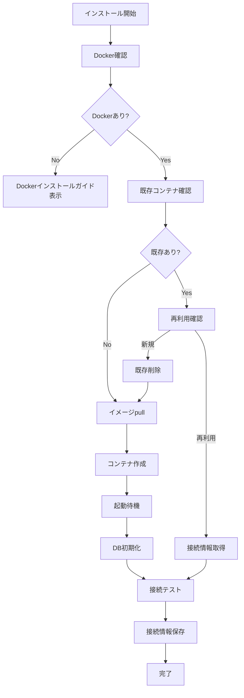

# MySQL Docker自動インストーラー設計書

## 1. 概要

MySQLがインストールされていない環境でも、ボタンクリックだけでDockerを使用してMySQLを自動的にセットアップする機能を実装する。PostgreSQL自動インストーラーをベースに、MySQL固有の設定に対応する。

## 2. 機能要件

### 2.1 基本機能
- Docker環境の確認と起動状態チェック
- MySQL Dockerイメージの自動pull
- コンテナの自動起動と設定
- データベース・ユーザーの自動作成
- 接続情報の自動生成と保存
- ヘルスチェックと接続確認
- 既存コンテナの検出と再利用
- MySQL固有の文字コード設定（UTF-8）

### 2.2 UI要件
- 「MySQLをインストール」ボタン
- インストール進捗表示
- 接続情報の自動入力
- エラー時の分かりやすいガイダンス

## 3. 技術設計

### 3.1 アーキテクチャ

```
┌─────────────────┐     ┌──────────────────┐     ┌─────────────────┐
│   UI (Wizard)   │────▶│ MySQL Auto       │────▶│  Docker Engine  │
└─────────────────┘     │ Installer        │     └─────────────────┘
         │              └──────────────────┘              │
         ▼                       │                        ▼
┌─────────────────┐     ┌──────────────────┐     ┌─────────────────┐
│   WebSocket     │     │  Config Store    │     │   MySQL         │
└─────────────────┘     └──────────────────┘     │   Container     │
                                                  └─────────────────┘
```

### 3.2 コンポーネント設計

#### MySQLAutoInstaller クラス
```javascript
class MySQLAutoInstaller {
  // 定数
  CONTAINER_NAME = 'scalardb-mysql';
  IMAGE_NAME = 'mysql:8.0';
  DEFAULT_PORT = 3306;
  
  // メソッド
  async checkPrerequisites()        // Docker環境確認
  async install(options)            // インストール実行
  async checkExistingContainer()    // 既存コンテナ確認
  async pullImage(progressCallback) // イメージダウンロード
  async createContainer(config)     // コンテナ作成
  async waitForReady(containerId)   // 起動待機
  async createDatabase(config)      // DB初期化
  async generateConnectionInfo()    // 接続情報生成
  async testConnection(config)      // 接続テスト
  async stop()                      // コンテナ停止
  async remove()                    // コンテナ削除
}
```

### 3.3 インストールフロー



### 3.4 設定項目

```javascript
{
  // 基本設定
  containerName: 'scalardb-mysql',
  imageName: 'mysql:8.0',
  
  // ポート設定
  hostPort: 3306,      // ホスト側ポート（自動検出）
  containerPort: 3306, // コンテナ側ポート
  
  // データベース設定
  database: 'scalardb',
  username: 'scalardb',
  password: '自動生成',  // セキュアなランダムパスワード
  rootPassword: '自動生成',  // MySQL root用パスワード
  
  // ボリューム設定
  dataVolume: 'scalardb-mysql-data',
  
  // 環境変数
  environment: {
    MYSQL_ROOT_PASSWORD: '自動生成rootパスワード',
    MYSQL_DATABASE: 'scalardb',
    MYSQL_USER: 'scalardb',
    MYSQL_PASSWORD: '自動生成',
    MYSQL_CHARSET: 'utf8mb4',
    MYSQL_COLLATION: 'utf8mb4_unicode_ci'
  }
}
```

## 4. 実装詳細

### 4.1 Docker環境確認

PostgreSQLと同様の実装を使用。

### 4.2 ポート競合回避

```javascript
async findAvailablePort(preferredPort = 3306) {
  // PostgreSQLと同じロジックだが、デフォルトポートが3306
  const checkPort = async (port) => {
    try {
      const server = net.createServer();
      await new Promise((resolve, reject) => {
        server.once('error', reject);
        server.once('listening', resolve);
        server.listen(port);
      });
      server.close();
      return true;
    } catch {
      return false;
    }
  };
  
  // 優先ポートから順に確認
  for (let port = preferredPort; port < preferredPort + 10; port++) {
    if (await checkPort(port)) {
      return port;
    }
  }
  
  throw new Error('利用可能なポートが見つかりません');
}
```

### 4.3 セキュアなパスワード生成

PostgreSQLと同じ実装を使用。

### 4.4 MySQL固有のヘルスチェック

```javascript
async waitForReady(containerId, maxRetries = 30) {
  for (let i = 0; i < maxRetries; i++) {
    try {
      // mysqladminを使用したヘルスチェック
      const result = await this.dockerExec(containerId, [
        'mysqladmin',
        'ping',
        '-h', 'localhost',
        '-u', 'root',
        `-p${this.rootPassword}`
      ]);
      
      if (result.includes('mysqld is alive')) {
        return true;
      }
    } catch (error) {
      // エラーは無視してリトライ
    }
    
    // 2秒待機（MySQLの起動はPostgreSQLより時間がかかる場合がある）
    await new Promise(resolve => setTimeout(resolve, 2000));
  }
  
  throw new Error('MySQLの起動がタイムアウトしました');
}
```

### 4.5 MySQL固有のコンテナ設定

```javascript
async createContainer(config) {
  const containerConfig = {
    Image: this.IMAGE_NAME,
    name: this.CONTAINER_NAME,
    Env: [
      `MYSQL_ROOT_PASSWORD=${config.rootPassword}`,
      `MYSQL_DATABASE=${config.database}`,
      `MYSQL_USER=${config.username}`,
      `MYSQL_PASSWORD=${config.password}`,
      'MYSQL_CHARSET=utf8mb4',
      'MYSQL_COLLATION=utf8mb4_unicode_ci'
    ],
    HostConfig: {
      PortBindings: {
        '3306/tcp': [{ HostPort: config.port.toString() }]
      },
      RestartPolicy: {
        Name: 'unless-stopped'
      },
      Binds: [`${this.DATA_VOLUME}:/var/lib/mysql`]
    },
    Cmd: [
      '--character-set-server=utf8mb4',
      '--collation-server=utf8mb4_unicode_ci',
      '--default-authentication-plugin=mysql_native_password'
    ]
  };
  
  return await this.dockerDeployer.createContainer(containerConfig);
}
```

## 5. エラーハンドリング

### 5.1 想定されるエラーと対処

| エラー | 原因 | 対処方法 |
|--------|------|----------|
| Docker未インストール | Dockerがない | インストールガイド表示 |
| Docker未起動 | デーモン停止中 | 起動方法を案内 |
| ポート使用中 | 3306が占有 | 別ポートを自動選択 |
| イメージpull失敗 | ネットワーク問題 | リトライまたは手動pull案内 |
| コンテナ起動失敗 | リソース不足等 | エラー詳細と対処法表示 |
| DB接続失敗 | 設定ミス | 自動診断と修正提案 |
| MySQL認証エラー | パスワード問題 | パスワード再生成提案 |

### 5.2 エラーメッセージ例

```javascript
const errorMessages = {
  DOCKER_NOT_FOUND: {
    title: 'Dockerが見つかりません',
    message: 'MySQLをインストールするにはDockerが必要です',
    action: 'Docker Desktopをインストール',
    link: 'https://www.docker.com/products/docker-desktop'
  },
  PORT_IN_USE: {
    title: 'ポートが使用中です',
    message: 'ポート{port}は既に使用されています。別のポートを使用します',
    action: '自動的に別のポートを選択しました'
  },
  MYSQL_AUTH_ERROR: {
    title: 'MySQL認証エラー',
    message: 'MySQLへの接続で認証に失敗しました',
    action: 'パスワードを再生成して再試行してください'
  },
  MYSQL_STARTUP_TIMEOUT: {
    title: 'MySQL起動タイムアウト',
    message: 'MySQLの起動に時間がかかりすぎています',
    action: 'システムのメモリとCPUを確認してください'
  }
};
```

## 6. PostgreSQLとの差異

### 6.1 主な違い

| 項目 | PostgreSQL | MySQL |
|------|------------|-------|
| デフォルトポート | 5432 | 3306 |
| Dockerイメージ | postgres:15-alpine | mysql:8.0 |
| ヘルスチェック | pg_isready | mysqladmin ping |
| 文字コード設定 | 自動UTF-8 | 明示的UTF-8設定が必要 |
| 認証方式 | 標準 | mysql_native_password推奨 |
| 起動時間 | 比較的高速 | やや時間がかかる場合あり |
| ルートユーザー | postgres | root（別途設定） |

### 6.2 MySQL固有の設定

- **文字コード**: utf8mb4（絵文字対応）
- **照合順序**: utf8mb4_unicode_ci
- **認証プラグイン**: mysql_native_password
- **ルートパスワード**: 必須設定
- **起動パラメータ**: 文字コード関連の明示的設定

## 7. テスト計画

### 7.1 単体テスト
- Docker環境チェックのテスト
- ポート検出のテスト（デフォルト3306）
- パスワード生成のテスト
- MySQL固有設定のテスト
- ヘルスチェック（mysqladmin ping）のテスト
- エラーハンドリングのテスト

### 7.2 統合テスト
- 実際のDockerとの連携テスト
- MySQLコンテナ作成・削除のテスト
- データベース接続のテスト（文字コード確認含む）
- 再インストールのテスト

## 8. セキュリティ考慮事項

- パスワードは暗号学的に安全な方法で生成
- ルートパスワードとユーザーパスワードを分離
- パスワードは環境変数として設定（コマンドライン露出回避）
- コンテナはデフォルトでローカルホストのみアクセス可能
- 不要なポートは開放しない

## 9. パフォーマンス考慮事項

- MySQL 8.0の最新版を使用
- 起動時のメモリ設定最適化
- データ永続化のためのボリューム使用
- 文字コード設定による性能への影響を最小化

## 10. 将来の拡張

- MySQL バージョン選択機能
- レプリケーション設定
- MySQL Workbench自動設定
- 既存DBのバックアップ・リストア
- クラウドマネージドサービスへの移行支援