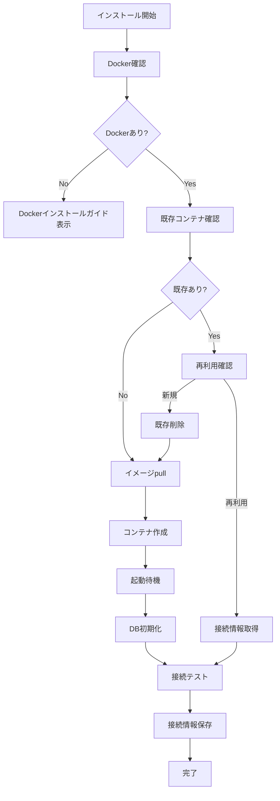

# PostgreSQL Docker自動インストーラー設計書

## 1. 概要

PostgreSQLがインストールされていない環境でも、ボタンクリックだけでDockerを使用してPostgreSQLを自動的にセットアップする機能を実装する。

## 2. 機能要件

### 2.1 基本機能
- Docker環境の確認と起動状態チェック
- PostgreSQL Dockerイメージの自動pull
- コンテナの自動起動と設定
- データベース・ユーザーの自動作成
- 接続情報の自動生成と保存
- ヘルスチェックと接続確認
- 既存コンテナの検出と再利用

### 2.2 UI要件
- 「PostgreSQLをインストール」ボタン
- インストール進捗表示
- 接続情報の自動入力
- エラー時の分かりやすいガイダンス

## 3. 技術設計

### 3.1 アーキテクチャ

```
┌─────────────────┐     ┌──────────────────┐     ┌─────────────────┐
│   UI (Wizard)   │────▶│ PostgreSQL       │────▶│  Docker Engine  │
└─────────────────┘     │ Auto Installer   │     └─────────────────┘
         │              └──────────────────┘              │
         │                       │                        ▼
         ▼                       ▼                 ┌─────────────────┐
┌─────────────────┐     ┌──────────────────┐     │   PostgreSQL    │
│   WebSocket     │     │  Config Store    │     │   Container     │
└─────────────────┘     └──────────────────┘     └─────────────────┘
```

### 3.2 コンポーネント設計

#### PostgreSQLAutoInstaller クラス
```javascript
class PostgreSQLAutoInstaller {
  // 定数
  CONTAINER_NAME = 'scalardb-postgres';
  IMAGE_NAME = 'postgres:15-alpine';
  DEFAULT_PORT = 5432;
  
  // メソッド
  async checkPrerequisites()        // Docker環境確認
  async install(options)            // インストール実行
  async checkExistingContainer()    // 既存コンテナ確認
  async pullImage(progressCallback) // イメージダウンロード
  async createContainer(config)     // コンテナ作成
  async waitForReady(containerId)   // 起動待機
  async createDatabase(config)      // DB初期化
  async generateConnectionInfo()    // 接続情報生成
  async testConnection(config)      // 接続テスト
  async stop()                      // コンテナ停止
  async remove()                    // コンテナ削除
}
```

### 3.3 インストールフロー



### 3.4 設定項目

```javascript
{
  // 基本設定
  containerName: 'scalardb-postgres',
  imageName: 'postgres:15-alpine',
  
  // ポート設定
  hostPort: 5432,      // ホスト側ポート（自動検出）
  containerPort: 5432, // コンテナ側ポート
  
  // データベース設定
  database: 'scalardb',
  username: 'scalardb',
  password: '自動生成',  // セキュアなランダムパスワード
  
  // ボリューム設定
  dataVolume: 'scalardb-postgres-data',
  
  // 環境変数
  environment: {
    POSTGRES_USER: 'scalardb',
    POSTGRES_PASSWORD: '自動生成',
    POSTGRES_DB: 'scalardb',
    POSTGRES_INITDB_ARGS: '--encoding=UTF-8'
  }
}
```

## 4. 実装詳細

### 4.1 Docker環境確認

```javascript
async checkPrerequisites() {
  // Dockerインストール確認
  const dockerInfo = await this.dockerDeployer.checkDockerInstalled();
  
  if (!dockerInfo.installed) {
    throw new UserFriendlyError(
      'Dockerがインストールされていません',
      'Dockerデスクトップをインストールしてからもう一度お試しください',
      'https://www.docker.com/products/docker-desktop'
    );
  }
  
  if (!dockerInfo.running) {
    throw new UserFriendlyError(
      'Dockerが起動していません',
      'Dockerデスクトップを起動してからもう一度お試しください'
    );
  }
  
  return true;
}
```

### 4.2 ポート競合回避

```javascript
async findAvailablePort(preferredPort = 5432) {
  const checkPort = async (port) => {
    try {
      const server = net.createServer();
      await new Promise((resolve, reject) => {
        server.once('error', reject);
        server.once('listening', resolve);
        server.listen(port);
      });
      server.close();
      return true;
    } catch {
      return false;
    }
  };
  
  // 優先ポートから順に確認
  for (let port = preferredPort; port < preferredPort + 10; port++) {
    if (await checkPort(port)) {
      return port;
    }
  }
  
  throw new Error('利用可能なポートが見つかりません');
}
```

### 4.3 セキュアなパスワード生成

```javascript
generateSecurePassword() {
  const length = 16;
  const charset = 'abcdefghijklmnopqrstuvwxyzABCDEFGHIJKLMNOPQRSTUVWXYZ0123456789!@#$%^&*';
  let password = '';
  
  const randomBytes = crypto.randomBytes(length);
  for (let i = 0; i < length; i++) {
    password += charset[randomBytes[i] % charset.length];
  }
  
  return password;
}
```

### 4.4 ヘルスチェック

```javascript
async waitForReady(containerId, maxRetries = 30) {
  for (let i = 0; i < maxRetries; i++) {
    try {
      // pg_isreadyコマンドを使用
      const result = await this.dockerExec(containerId, [
        'pg_isready',
        '-U', 'scalardb',
        '-d', 'scalardb'
      ]);
      
      if (result.includes('accepting connections')) {
        return true;
      }
    } catch (error) {
      // エラーは無視してリトライ
    }
    
    // 1秒待機
    await new Promise(resolve => setTimeout(resolve, 1000));
  }
  
  throw new Error('PostgreSQLの起動がタイムアウトしました');
}
```

## 5. エラーハンドリング

### 5.1 想定されるエラーと対処

| エラー | 原因 | 対処方法 |
|--------|------|----------|
| Docker未インストール | Dockerがない | インストールガイド表示 |
| Docker未起動 | デーモン停止中 | 起動方法を案内 |
| ポート使用中 | 5432が占有 | 別ポートを自動選択 |
| イメージpull失敗 | ネットワーク問題 | リトライまたは手動pull案内 |
| コンテナ起動失敗 | リソース不足等 | エラー詳細と対処法表示 |
| DB接続失敗 | 設定ミス | 自動診断と修正提案 |

### 5.2 エラーメッセージ例

```javascript
const errorMessages = {
  DOCKER_NOT_FOUND: {
    title: 'Dockerが見つかりません',
    message: 'PostgreSQLをインストールするにはDockerが必要です',
    action: 'Docker Desktopをインストール',
    link: 'https://www.docker.com/products/docker-desktop'
  },
  PORT_IN_USE: {
    title: 'ポートが使用中です',
    message: 'ポート{port}は既に使用されています。別のポートを使用します',
    action: '自動的に別のポートを選択しました'
  },
  CONTAINER_EXISTS: {
    title: '既存のPostgreSQLが見つかりました',
    message: '以前インストールしたPostgreSQLが見つかりました',
    action: '既存のものを使用するか、新しくインストールするか選択してください'
  }
};
```

## 6. テスト計画

### 6.1 単体テスト
- Docker環境チェックのテスト
- ポート検出のテスト
- パスワード生成のテスト
- エラーハンドリングのテスト

### 6.2 統合テスト
- 実際のDockerとの連携テスト
- コンテナ作成・削除のテスト
- データベース接続のテスト
- 再インストールのテスト

## 7. セキュリティ考慮事項

- パスワードは暗号学的に安全な方法で生成
- パスワードは環境変数として設定（コマンドライン露出回避）
- コンテナはデフォルトでローカルホストのみアクセス可能
- 不要なポートは開放しない

## 8. パフォーマンス考慮事項

- Alpine Linuxベースの軽量イメージ使用
- 不要なPostgreSQLモジュールは含まない
- データ永続化のためのボリューム使用
- 起動時間短縮のための最適化

## 9. 将来の拡張

- PostgreSQL バージョン選択機能
- 既存DBのバックアップ・リストア
- レプリケーション設定
- 監視ツール統合
- クラウドマネージドサービスへの移行支援